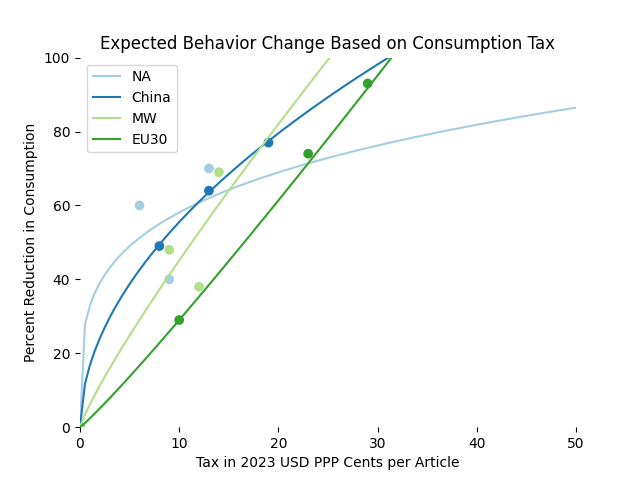

Used in the scenario "Packaging Consumption Tax" on the first tab, this intervention reduces consumption only in the packaging sector based on a conversion from size of tax to expected reduction in consumption.

\bigskip
 
 

# Introduction
In addition to making assumptions within the modeling, this intervention relies on information external to the model in order to convert from size of tax to expected reduction.

\medskip
 

## Assumptions

- The change in consumption to the change in waste generation is subject to lifecycle distribution delays.
- The only change in consumption due to this intervention will be in the packaging space.
- Decreases in consumption of plastic packaging will not cause appreciable increases in the consumption of other non-packaging plastic goods.
- The behavior response to a tax on plastic packaging in general will be similar to the behavior response seen in a tax on plastic bags.
- The tax rate $x$ will be different in different regions.
- The tax rate $x$ is expressed as USD per article in all regions.
- There is a fit function $y$ converting from $x$ to change in consumption.

\medskip
 

## External knowledge
This considers a variety of data sources on existing packaging consumption taxes. Specifically, note that there have been multiple examples types of taxes applied to single use plastic items like plastic bags across regions which we normalize for PPP and inflation [@he_effects_2012; @scaan_effectiveness_2019; @wolfram_alpha_developers_wolframalpha_nodate; @thomas_english_2019; @martinho_portuguese_2017; @convery_most_2007; @homonoff_skipping_nodate; @opinonworks_ddoealice_2013; @city_of_boulder_disposable_nodate; @dikgang_analysis_2012; @ministry_of_environmental_protection_israelis_2020; @nishijima_survey_2024; @rokoua_mataiciwa_plastic_2021; @protafolio_impuesto_2022; @the_world_bank_group_ppp_nodate; @world_bank_group_inflation_nodate; @homonoff_preliminary_2017]. We also offer additional sources of interest in our works cited [@carr2020; @vdeq; @montgomery; @chicago; @maine; @boland2020; @wang2022; @anastasio2022; @uk2021; @licollari2023; @agencia; @ey]. Though information is available on multiple types of taxes, this intervention gives particular attention to plastic bag taxes paid by consumers.

\bigskip
 
 

# Primary impact
This intervention assumes a change in packaging only:

$C_{packaging} = C_{packaging} - \Delta_{packaging}$

This delta is found through the following formula:

$\Delta_{packaging} = y(t) * C_{packaging}$

This formula includes a mixture of parameters given by external literature and user configuration. Note that $\Delta_{packaging}$ requires propagation across waste and imports as described below.

\medskip
 

## Consumption impact modeling
To determine the change in consumption function for a tax rate $y(t)$, a fit model is used.

### Non-linearity
Though few data points are available, observed data show non-linearity as seen in the included figure. Therefore, we allow fit models to fit second order curves.

### Fit models
All this in mind, the function $y$ has a number of expectations:

 - The function is only valid within a domain that maps to the range 0 to 1.
 - The domain must be positive.
 - The function needs to be monotonic in that range.
 - A zero cent tax would result in no reduction in consumption.
 - There’s evidence of non-linearity but potentially different degrees in different regions.

To meet these constraints, a curve is fit for $y(t) = max(min(t^a * b, 1), 0)$:

|       | a     | b     |
|-------|-------|-------|
| China | 0.519 | 0.168 |
| EU30  | 1.082 | 0.024 |
| NAFTA | 0.247 | 0.329 |
| RoW   | 0.862 | 0.062 |

These result in the following curves:

Absent additional information, this curve-fitting approach provides a reasonable starting point based on observed evidence. However, note that we remain skeptical about out of sample prediction. Consider the following "high" tax examples for each region:

|        | Tax per Article in USD PPP Cents |
|--------|----------------------------------|
| China  | 19                               |
| EU     | 23                               |
| NAFTA  | 13                               |
| RoW    | 14                               |

Therefore, the user receives a warning in the UI if they simulate tax levels above these tax levels and the scenarios shown to the user on the overview tab stay within sample.

\bigskip
 
 

# Secondary impact
The reduction $\Delta_{packaging}$ is distributed proportionally across waste within the region:

$W_{fate} = W_{fate} - \frac{W_{fate}}{W_{total}} * \Delta_{packaging}$

This change in waste is subject to lifecycle distribution delays though, in this case, only a single sector is impacted. Note that imports also change as a result of reduced consumption:

$T_{import} = T_{import} - \frac{T_{import}}{C_{total}} * \Delta_{packaging}$

Here $C$ is all input plastics (consumption) including domestic production and imports.

\bigskip
 
 

# Tertiary effects
As imports have changed, exports from other countries will reduce as well:

$T_{region-export} = T_{region-export} - \frac{T_{region-export}}{T_{total-export}} * \Delta_{import}$

Note that $\Delta_{import}$ comes from the region in which the intervention was introduced. Furthermore, one of the end of life fates impacted is waste trade and other regions experience secondary effects in the simulation (see waste trade interventions).

\bigskip
 
 

# Discussion
This technical note now turns to performance as well as interactions and future work.

\medskip
 

## Model fit
The model performance is likely poor on out of sample prediction given only three data points. This provides, however, a reasonable approximation absent other information.

\medskip
 

## Interactions
This intervention may interact with others in multiple ways but the primary mechanisms are consumption and waste. First, this lever's reductions are visible in production and consumption-dependent interventions like minimum recycled content. For example, a cap on virgin production can use this lever as "credit" towards its goal before further reducing plastic generation to meet its target. Second, this impacts waste like the amount of recyclable material available for interventions such as minimum recycled content. To that end, the reduction in available recycled material is visible for waste-dependent interventions including caps on different waste streams.

In practice, this intervention places a constraint on production of plastics alongside the constraints considered by other interventions and the "strictest" constraint is the one that is ultimately reported. The same holds true for waste generation impact such that another intervention may "supersede" this lever if the materials being reduced by this intervention do not allow that other lever to achieve its goals.

Of course, some bans also target specific subsets of packaging such as polystyrene. This intervention assumes that the removal of a polymer does not overall change the behavior response to a tax on the remaining packaging products. Future work may reconsider this stance with more detailed information.

\medskip
 

## Future work
 - A different version of this intervention could look at price sensitivity curves for specific products and simulate at the product level instead of the sector level.
 - A more sophisticated or accurate regression could be performed if additional data points on behavior response to bans becomes available for each region.
 - A more $y(t)$ for $\Delta_{packaging}$ could be derived from additional behavioral economics study or empirical human trials.

\bigskip
 
 

# Works Cited