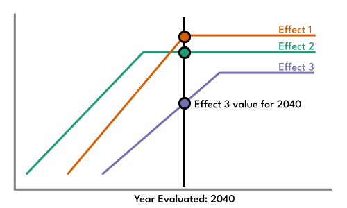
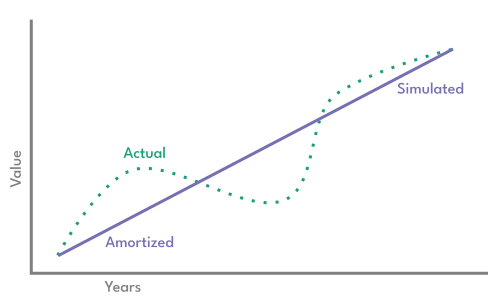

This tool's interventions' often operate across multiple streams and stages of the plastics lifecycle. They may change rates of recycling in the past or landfill in the future, in the process interacting both with each other and with themselves through time. This document outlines how the user can control these mechanisms and how they operate functionally including where certain approximations are made.

\bigskip
 
 

# User controls
The assumptions sections in the second "details" tab provide a number of controls which are often specific to a small number of interventions. However, all use policy start and policy complete dates. The user can change these controls within the tool to customize different policy scenarios.

\medskip
 

## Policy start date
By default, policies are expected to start showing impact in 2025, reflecting both a delay in actual legislation ratification. This date also prevents the simulation accidentally assuming that interventions will have made a change in the past prior to the passage of legislation.

\medskip
 

## Immediate policy complete date
This tool operates on two "complete" dates. The first is for "immediate" policies which would happen quickly, primarily though a change in a legal framework. The policies using this date include:

 - Taxes such as a packaging consumption tax.
 - Narrow product bans such as banning polystyrene.

Set to 2030 by default, this accounts for the logistical time needed to introduce these interventions but also affords for some delay to achieve compliance and behavior impact.

\medskip
 

## Gradual policy complete date
The second "complete" date is for gradual policies. This includes deployment of capital or caps like on virgin plastic production what may be phased in over time to allow time for adjustment.

 - Infrastructure investment such as in incineration, landfill, or recycling.
 - Mandates for recycling including a minimum recycling collection rate or a minimum recycled content.
 - Production limits such as caps on virgin plastic production.

Set to 2040 by default, the tool assumes that the impact of these interventions "phases in" over time before coming into full force at this complete date.

\bigskip
 
 

# Longitudinal effects
All interventions have changes which happen over time. These "longitudinal" effects are typically a result of how long it takes for a product to become waste (lifecycle delay), how long it takes for recycled waste to become available to use in new products (recycling delay), and how long it takes for policies to both go into effect and to achieve compliance / behavioral impact (policy delay).

## Lifecycle delays
Plastic products experience different duration of use before becoming waste. This tool assumes that those durations are summarized at the sector level where the life-cycle timeline of plastic packaging is shorter than plastic used in construction. With expected lifecycle delays configurable by the user, impacts to consumption experience a delay before those changes "reach" waste streams. In other words, a change in plastic packaging production in 2025 won't have an impact on the amount of mismanaged waste until 2026. In practice, the tool determines this delay based on the distribution of the change in consumption across the different sectors each with their own lifecycle expectation.

\medskip
 

## Recycling delay
The tool expects that there is some delay between when plastic waste enters the recycling stream to when that recycled plastic can be used in new products. By default, the tool expects a delay of a year. So, changes in recycling collection rate won't "reach" consumption until a year after the change was introduced. Once again, the user may configure this time delay, including setting it to zero.

\medskip
 

## Policy delay
As discussed above, policies may take some time to both implement and to achieve desired physical changes in plastics streams. For example, the appropriation of 1 billion dollars to create new recycling infrastructure on January 1 will not result in increased recycling on January 2. The tool assumes a single start date when policies begin making an impact and two different "complete" dates depending on the intervention where one expects short-term change due to a policy and the other expects a longer term change.

\medskip
 

## Implementation of delays
Interventions can work both forwards and backwards in time. For example, minimum recycled content may change not only consumption in the year being evaluated but both how much recycling was done in the past in order to meet expected upcoming demand and how much recycling is available in the future. That future recycling may impact other interventions such as recycling infrastructure investment.

This longitudinal nature of interventions creates a challenge in that levers cannot easily pass values from one year to another and, instead, all years need to be evaluated as if in parallel. The tool achieves this by constructing a series of longitudinal effects for each intervention that all have start and complete years and which are offset by the delays discussed above. This means the system maintains a frame of longitudinal effects which can be queried for a single year without needing to execute code for prior or later years, removing a circular dependency in calculation.

Another way to think of this is that all of the effects are calculated "just in time" as opposed to explicitly carrying values from one year to next. All that said, this system does assume that these are linear effects in that the phase in of a policy is linear, the impact on waste is amortized across sectors, and recycling goes back into production in a linear way.

In practice, this tool is using averages to represent full distributions which may cause bumpiness in impacts to get "smoothed" out. However, this amortization reflects that the exact delay distribution is not always fully understood and that the average still represents the system-wide effects well. This also dramatically simplifies the engineering effort including for testing / the ability to confirm that the system is operating as expected. Overall, given the practical expected application of the tool, this amortization approach is deemed safer. Finally, this report notes that the business as usual "baseline" model does not take this linear amortization approach as it does not need to stack interventions dynamically.

\bigskip
 
 

# Intervention interactions
Interactions between interventions are handled through two mechanisms. The first preferred system is a constraints-based approach in which interventions can apply effects as if in parallel. The second is a prioritized order of execution to manage interactions where one intervention's effects must be considered before that of another.

\medskip
 

## Constraints-based
The preferred approach, interventions do not explicitly set values but instead introduce constraints. Consider the following example where three recycling related levers are in use:

 - Minimum recycling rate policy mandates 20% collection (equivalent to 10 MT).
 - Recycling infrastructure investment provides capacity for 12 MT of plastic to be recycled.
 - Minimum recycled content requires 15 MT of recycled materials to meet demand.

In this case, each intervention imposes a minimum on the recycling end of life fate and the maximum of those minimums prevails:

$W_{recycling} = max(W_{min-recycling} \in levers)$

In this case, it does not matter in what order the tool evaluates each intervention's code. For example, regardless of if the minimum recycled content intervention is evaluated before minimum recycling rate, the recycling waste stream will still be set to 15 MT in this example.

\medskip
 

## Prioritized execution
Though constraints remain the preferred way to interact interventions, sometimes one lever must evaluate before another within a specific year like when one intervention's goal is dependent on the effect of another. For example, a plastic packaging tax may reduce consumption, also reducing the amount of recycled material required for a minimum recycled content mandate. The tool assigns each lever a priority number where lower priority numbers go first. In this example, the tool uses a priority of -1 for the consumption tax and 4 for min recycled content.

\medskip
 

## Direct interaction
Finally, if prioritized execution and constraints-based approaches fail to capture interaction effects, one lever may inspect the value of another. At time of writing, no interventions actually do this but the mechanism remains available.

\bigskip
 
 

# Discussion
Though this tool makes some simplifying assumptions such as amortization / linearization of certain effects, this approach uniquely allows interventions to avoid circular dependency and offers an easy way to create new interventions that easily interact with others already implemented. In particular, the constraints based approach and offset longitudinal effects enable multiple interventions to operate predictably on overlapping variables while still being easy to evaluate / test analytically. Even still, future implementations may consider removing this linear amortization step to better capture localized longitudinal effects even as the overall effects of interventions are still captured well by this tool.
