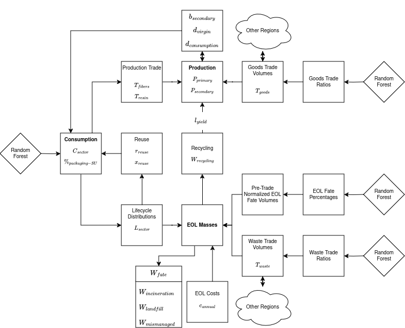

**Abstract:** Machine learning method to predict future plastic production, trade, and end of life fate. Responsive to socio-economic trends, this multi-model system enables regionalization of global material flow projections. After sweeping regressors ranging from simple linear models to sophisticated ensembles, this investigation recommends random forest as validated by temporally in-sample and out-of-sample hidden set tasks as well as regional trials.

  \bigskip

# Introduction
Prediction of global plastics involves tracing materials across the planet, volumes and flows which relate to a number of socio-economic factors. For example, prior work examines plastic waste in context of population and gross domestic product [@hoornweg_environment_2013]. Still, some studies projecting global plastic trends do not explicitly include GDP and population in extrapolation [@geyer_production_2017]. In practice, the level of granularity of predictions dictates the degree to which modeling must include related variables.

## Global prediction
As near-term global population and GDP generally continue their recent upwards trajectory, predicting future plastic scenarios at the global level may treat these related variables as latent [@desa_world_2022; @oecd_real_2023]. With literature precedent, drawing past trends forward maintains the desirable simplicity of extrapolation through single variable linear models^[Polynomial regression is often considered as a form of linear regression [@pardoe_polynomial_2018]. Extrapolation with a linear model means fitting first or second order polynomials with year as the only input and the variable extrapolated as the response.] without requiring other socio-economic inputs [@geyer_production_2017]. 

## Regional prediction
In contrast, near-term regional projections defy simple extrapolation. For example, compare population and GDP expectations for the entire planet versus China in isolation [@desa_world_2022; @oecd_real_2023].

 - Global level predictions expect increases in population and GDP similar to historic trends.
 - As discussed in literature, China-level predictions expect a national population decrease alongside GDP deceleration in contrast to recent growth [@dai_evaluation_2022; @oecd_real_2023].

Unlike global scale, simple extrapolation of plastics in China leads to implausible projections as if nothing changes, indirectly predicting dubious increases in per-capita Chinese consumption.

This example in mind, sophisticated region-level predictions require bringing those related variables into modeling, anticipating future changes not obvious from "drawing" historic plastic values "forward" in isolation.

  \bigskip

# Methods
This article regionalizes global plastics projections by using related variables [@geyer_production_2017; @hoornweg_environment_2013]. Specifically, models take socio-economic inputs:

 - Population predictions from the United Nations [@desa_world_2022].
 - Long term gross domestic product projections from the Organization for Economic Cooperation and Development [@oecd_real_2023]. 

Structurally, this method extends the material flow approach to four regions: China, Europe (EU30), North America (NAFTA), and Rest of World (RoW).

Though predicted individually, the system forecasts using a multi-model machine learning system blended with traditional approaches.

## Consumption
Prior work expects plastic consumption to increase so regressors commonly need to make predictions outside the training data range [@geyer_production_2017]. Therefore, models use a time displacement approach in which the goal is not to predict absolute consumption but instead the change in that consumption (response variable $R_{production}$).

$C_{sector} - C_{sectorref} = R_{production} \mathrel{\hat=} f_\theta(\Delta_{years}, \Delta_{GDP}, \Delta_{population}, region, sector)$

This formulation uses the years between the reference year to year predicted, one-hot encoded region, one-hot encoded sector, change in GDP, and change in population as inputs to predict the change in production for the selected region.

## Goods trade
Similar to consumption, this modeling approach attempts to constrain the output domain. Therefore, the "goods trade" regressors predict a modified response variable $R_{goods}$ which represents the ratio of goods either imported or exported to overall consumption for a region.

$\frac{T_{goods}}{C} = R_{goods} \mathrel{\hat=} f_\theta(\Delta_{years}, \Delta_{gdp}, \Delta_{population}, region, type, R_{goodsref})$

Note that "goods" refers to all plastics traded before end of life and includes the following one-hot encoded types: articles, fibers, resin, and other goods. Put another way, the regressors predict this ratio from the years between the reference year to year predicted, one-hot encoded region, type, change in GDP, change in population, and the response variable value from the reference year.

## Production
Modeling determines production ($P$) mechanistically from consumption ($C$):

$P = C - T_{goods}$

$T_{goods}$ refers to regional net trade of all plastics prior to end of life and may be negative in the case of net exports.

## Lifetime
Lifecycle distributions define the expected time delay from plastic being made to reaching end of life (recycled, landfilled, incinerated, or mismanaged). This article uses lifecycle distributions per sector as described in prior work [@geyer_production_2017]. Note that distributions apply to plastic consumption in the region consumed before waste trade.

## Waste trade
Similar to goods trade, the waste trade regressors restrict the output range with a modified response variable $R_{waste}$. However, modeling does not have access to the amount of projected waste at time of training so creates this ratio using consumption for a region:

$\frac{T_{waste}}{C} = R_{waste} \mathrel{\hat=} f_\theta(\Delta_{years}, \Delta_{gdp}, \Delta_{population}, region, R_{wasteref}, F_{sword})$

The regressors predict this ratio from the years between the reference year to year predicted, one-hot encoded region, change in GDP, change in population, the response variable value from the reference year, and a flag indicating if China’s National Sword policy is active in the year being predicted [@vedantam_impact_2022].

## End of life fate
Historic data frequently detail the percentage of waste in a region by fate and modeling reflects this formulation in response variable $R_{EOL}$:

$\frac{W_{fate}}{W_{total}} = R_{EOL} \mathrel{\hat=} f_\theta(\Delta_{years}, \Delta_{gdp}, \Delta_{population}, region, fate, R_{EOLref})$

Having determined the mass of materials reaching end of life and after applying waste trade, the system can apply these percentages to determine regional fate mass. The regressors predict this percentage from the years between the reference year to year predicted, one-hot encoded region, EOL fate (mismanaged, landfill, incineration, recycling), change in GDP, change in population, and the response variable value from the reference year.

## Machine learning sweeps
Each sweep considers multiple modeling approaches:

 - **Linear models**: Ridge regression with regularization parameters from 0 to 1 at increments of 0.2. Note that discussion explores fitting higher order curves.
 - **Support Vector Regression**: SVR with multiple kernels (linear, polynomial, RBF) up to a degree of 4 and alpha ranging from 0 to 0.8 at increments of 0.2.
 - **Regression Trees**: Max depth of 2 to 20 at increments of 1.
 - **Random Forest**: Max depth of 2 to 20 at increments of 1 with 5 to 30 estimators at increments of 5. Note that this tries each pair of max depth and estimator count with estimators accessing all features, random log2 number of features, and random square root number of features.
 - **AdaBoost**: Max depth of 2 to 20 at increments of 1 with 5 to 30 estimators at increments of 5.

For additional details, see the [open source pipeline repository](https://github.com/SchmidtDSE/plastics-pipeline). Using implementations from scikit-learn [@pedregosa_scikit-learn_2011].

## Temporal distance
Note that the pipeline trains all models to predict not just from one year to the adjacent but up to 5 years either in the future or in the past, further expanding output ranges.

## Application of predictions
The regressors estimate their response variables $R$ individually per region but the final projections require conversion to the total masses of production, consumption, trade, and waste. In this process, some predictions rely on others. For example, the amount of waste in a NAFTA’s landfill relies on EOL fate percentage and waste trade. Meanwhile, waste trade relies not just on NAFTA but other regions as well. Therefore, the system estimates^[Open source software provides a flow chart in Figure \ref{flow} [@noauthor_diagramsnet_2023].]:

 - Production after consumption and goods trade. 
 - Amount of plastics reaching end of life after consumption. 
 - End of life mass after waste fate percentages, waste trade, and amount of plastics reaching end of life. 

Furthermore, the system normalizes predictions. First, the waste fate percentages are normalized to 100% within each region:

$W_{fatenorm} = \frac{W_{fate}}{W}$

Similarly, for both goods and waste, this pipeline scales trade numbers after conversion to  mass based on the size of the unscaled trade numbers per region so global net imports equal net exports. See the [open source pipeline repository](https://github.com/SchmidtDSE/plastics-pipeline) for further details on the conversion of response variables to final prediction.

  \bigskip

# Results
Evaluation begins with traditional in-sample analysis. However, this article also considers a various post-hoc evaluations.

## In-sample performance
Modeling uses a train, validation, and test split constructed from all available years of 67% of data for training and 17% for validation due to dataset size.

{ width=80% }

While often not the lowest validation mean absolute error (MAE), random forest offers strong hidden set performance with fewer signs of overfit compared to others like AdaBoost. Structurally, random forest can handle expected non-linearity and, suggesting stability, a number of the swept forests reflect similarly strong performance. Given these results, this article chooses random forest for all response variables.

|             | Test MAE (MMT) | Estimators | Max Depth | Max Features |
|-------------|----------------|------------|-----------|--------------|
| Consumption | 1.15           | 15         | 9         | sqrt         |
| Goods Trade | 1.59           | 20         | 15        | log2         |
| Waste       | 0.01           | 30         | 19        | sqrt         |
| Waste Trade | 1.29           | 5          | 10        | all          |

The selected random forests' test errors remain acceptable for all regressors.

## Out-Sample performance
Practical usage sees models primarily making predictions in future years, time ranges beyond the training data. Given the need for "out of sample" functionality, this study confirms performance by hiding data after 2018 before training models and evaluating 2019 predictions (avoiding 2020 consumption abnormalities).

Though the in-sample performance measures already select random forest, this investigation reports metrics for all model types for completeness. Random forest performs consistently well.

## Regional performance and sensitivity
This effort aims to ensure strong cross-class performance in each retraining. Of particular concern, region appears across all regressors and sharply imbalanced performance in this axis could raise equity concerns. This in mind, analysis retrains 100 random forests of the selected configuration for each response variable with different training set selections to determine sensitivity to stochastic effects and to validate that, across trails subject to noise, performance remains acceptable in all regions. 

Though China sees slightly elevated error, the MAE remains satisfactorily contained with the consumption regressors comfortably below 2 MMT and the ratios staying below 0.04. The discussion explores these results' implications.

  \bigskip

# Discussion
This machine learning method enables responsiveness to socio-economic trends  while maintaining strong equity-respecting regional performance even as it leaves some additional modeling approaches to future work.

## Socio-economic trends
Returning to China as a motivating example, the machine learning approach appears responsive to expectations for population and GDP [@dai_evaluation_2022].

This reflection of slowed plastics growth speaks to this method’s capability of responding to socio-economic factors.

## Linear models
The sweep includes linear models which perform relatively poorly. That said, this article notes that time displacement and one-hot encoding may prevent strong curve fitting results. Therefore, consider a follow-up experiment in which the four response variables each get individually fit with both first and second-order polynomial curves per region per class. For example, a single model predicts electronics consumption in NAFTA^[The same normalization of trade and waste apply to these trials and negative numbers are set to zero.]. Due to the very small data available for each model, this sweep selects the “best” model through the out-of-sample task alone.

$C_{electronics-nafta} \mathrel{\hat=} f_\theta(x_{gdp-nafta}, x_{population-nafta})$

While these models may capture short term trends, this approach still leads to dubious claims such as the end of electronic waste in NAFTA shortly after 2030. Poor generalization may partially explain inadequate performance of linear models in the overall larger sweep.

All this in mind, this article continues to recommend the random forest approach.

## Limited dataset
The data available for modeling represent a valuable, extensive, and hard fought contribution that still remains temporally limited. The overlap of the many threads of data required for modeling only reliably span 2005 to 2020, just enough to capture relationships to socio-economic variables. Future work with expanded historical range may see improved performance but these models only train on actual data given the potential equity concerns that come with uneven levels of imputation across regions.

These design constraints in mind, consider that the training set in the sweep only uses includes two thirds of those limited data to support evaluation. That said, following general production machine learning practices, this models in the production tool at https://global-plastics-tool.org are retrained with all data prior to release to take full advantage of this small dataset [@brownlee_how_2017]. This means that the error measurements in this report remain only estimates of the productionized system.

## Responsible AI
This project takes a number of steps to ensure equity in its results. This includes structural choices like forgoing imputation but it also includes choices in monitoring and sweeping as well. For example, model selection takes place with consideration of overfitting given the potential for geographic bias. Additionally, performance evaluation explicitly includes region as an axis of concern to prevent major disparities in performance.

On that note, though finding no region with disproportionately high error compared to others, China's MAE remains slightly elevated. Possible explanations:

 - In part due to policy activity such as National Sword, China shows substantial change within the recent dataset so, in its dynamic nature, may become more difficult to predict [@vedantam_impact_2022].
 - China predictions may be impacted by the nation's high trade activity, exposing it to additional uncertainty from other regions or trade numbers.
 - Other still latent variables uniquely impact some regions like China and later modeling may consider expanding inputs.

Despite these concerns, the error rates for all regions still remain well contained. So, for the purposes of evaluating overall policy impact, the current model error remains acceptable.

Additionally, this article acknowledges that the “rest of world” region groups together many geographically, economically, and socially disparate populations. Unfortunately, this characterization largely reflects data availability. Therefore, this effort invites additional research to further regionalize these results.

## Policies
In general, the pipeline leaves policy effects to the simulation engine built on top of the machine learning outputs as discussed elsewhere in supplemental materials. That said, in addition to policies under consideration, some governments have already undertaken intervention which may dramatically impact results. The historic data may not yet capture recent policies' effects in “business as usual” projections. 

This in mind, this project addresses two major suites of policies which likely impact mismanaged waste at the regional level:

 - **China National Sword**: This policy causes a marked recent shift in waste trade [@vedantam_impact_2022]. Though very recent, its effects are highly visible in the very end of the available dataset. Therefore, modeling responds by adding a boolean variable for if the policy is active or not to the input vector for the waste trade model, allowing regressors to "understand" that a structural change has taken place without specifying the exact nature of that change explicitly.
 - **EU Waste Directive**: This policy continues gradually over time with some of its effects conflated potentially with GDP. That said, its legally enforced mandate of limiting landfill to 10% by 2035 goes beyond historical precedent [@ec_landfill_nodate]. Therefore, this pipeline includes this as a mechanistic “policy” turned “on” by default in the projections.

The pipeline does not include other policies enabled by default because:

 - Policies may be too localized to adequately model in the machine learning phase given the coarseness of the existing data.
 - The effects of those policies are not yet clear.
 - The historic data capture intervention effects well even as they remain latent. 

That said, due to the open source nature of this work, others may be implemented in the policy simulation layer after the pipeline. Additionally, more granular regions achieved in future work may allow incorporation of additional known policies that operate at the country or sub-national level.

## Open source
The open source repository at https://github.com/SchmidtDSE/plastics-pipeline offers an implementation of the described methods under a permissive open source license. The research team invites collaboration on this shared public resource.

## Additional future work
In addition to the possibilities for future work described above, this article also calls for future probabilistic predictions which incorporate understanding of uncertainty in long term projections. To that end, much of the data leveraged by this project do not offer uncertainty estimates themselves and this article encourages future work in probabilistic quantification.

## Acknowledgements
This article uses color schemes from ColorBrewer [@brewer_colorbrewer_2013].

  \bigskip

# Conclusion
This novel projection method builds upon prior work by incorporating machine learning approaches to enable regionalization of plastics forecasting. Suggesting a multi-model random forest system paired with traditional mechanistic techniques, this open source contribution enables responsiveness to relevant socio-economic factors like population and GDP while still affording substantial mechanisms for inspection. Furthermore, this article examines questions of equity to encourage positive impact. Taken altogether, this research offers a solid foundation for exploring the impact of global coordinated policy action while providing important region-level visibility into plastic trends. Finally, this project provides guideposts to future efforts which may consider additional policies and further granular regionalization of projections.

  \bigskip

# Works Cited