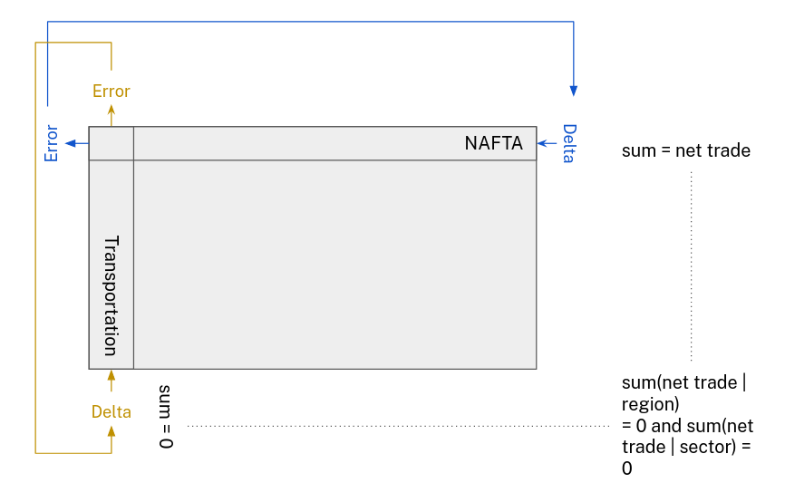
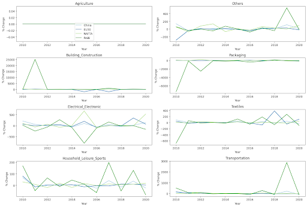
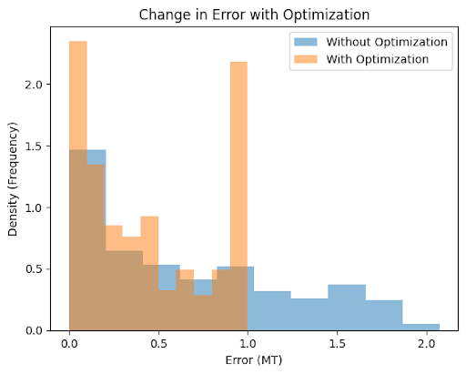
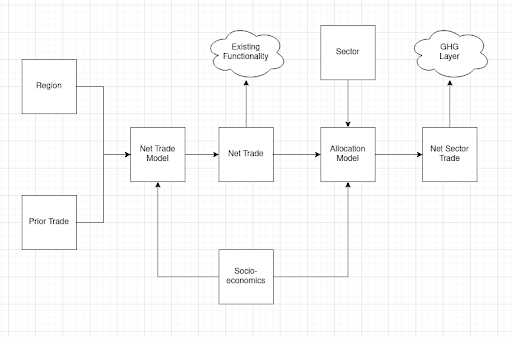

**Abstract**: Considering material both fully domestic and traded, this document presents data and methods for estimating polymer-level volumes. Supported by these new data as well as resources from the literature, this work also provides guidance for adding greenhouse gas emissions calculations. Finally, in addition to presenting these approaches, this document also details options to support equity.

\bigskip
\bigskip

# Introduction
Polymer-level volumes and greenhouse gas emissions may help inform ongoing treaty negotiation by providing a more holistic view of policy impacts [@unep_fourth_nodate]. That in mind, this methods document describes how to integrate greenhouse gas emissions ("GHG") and polymer volumes into projections.

\bigskip

## Prior work
The literature provide a number of resources discussing both sector-level plastics production and greenhouse gas emissions. For this study,

 - @geyer_production_2017 offer sector-level polymer ratios.
 - @zheng_strategies_2019 offer polymer-level production and conversion emissions as well as GHG associated with different end of life fates.

This document extends on prior work by using these values in the context of:

- Potential policies as a way to better understand intervention implications.
- Regional-level polymer calculation.

Specifically, these resources integrate into the modeling approaches discussed elsewhere in these supplemental materials.

\bigskip

## Projections from modeling
The upstream models have access to following inputs as discussed elsewhere in supplemental materials:

 - Overall production by region^[Not available at sector level.].
 - Sector-level consumption by region.
 - Lifecycle distributions by sector.
 - Net goods trade by sector by region.
 - Net waste trade by region and fate.

As prior work provides polymer ratios at the sector-level, this method sets aside production numbers but can take advantage of waste mass predictions by fate. Therefore, modeling makes the following available with forward prediction:

 - Sector-level consumption.
 - Net goods trade by region.
 - Net waste trade by region.
 - Waste mass after trade by region and fate.

These are provided longitudinally and are manipulated by policy simulation.

\bigskip
\bigskip

# Method
This method calculates the the total GHG emissions ($E$) for a region as follows:

$E = E_{goods} + E_{waste}$

These terms are explored in detail below.

\bigskip

## Assumptions
To use these data, this study employs the following assumptions:

 - **Assumption 1:** Any plastic types not explicitly mentioned are assumed to be sufficiently approximated by the GHG of the "other" type offered by literature.
 - **Assumption 2:** These global summary numbers offered by the literature sufficiently approximate regional GHG values.
 - **Assumption 3:** Mismanaged waste causes 0 kg CO2e/ton.
 - **Assumption 4:** Production, conversion, and end of life are the only sources of GHG to be included in calculations^[As an extension of **Assumption 4**, note that this study also assumes emissions from trade itself (shipping) are not included in calculations.].
 - **Assumption 5:** The sector baseline polymer ratios sufficiently approximate the polymer ratios under policy interventions or, in other words, policy interventions do not change polymer ratios for the purposes of GHG.

Though further discussed below, the method also _begins_ by assuming the following before exploring their relaxation:

 - **Assumption 6:** Emissions for goods trade are assigned to the region of production.
 - **Assumption 7:** Emissions for waste trade are assigned to the destination region.
 - **Assumption 8:** Average of global trade sector ratios approximates actual regional volumes.

Discussion further examines these assumptions and offers guidance for future work.

\bigskip

## Consumption
$E_{goods}$ refers to GHG associated to goods either both produced and consumed within the same region or exported from a region. Here $p$ refers to a single polymer and $s$ refers to a sector:

$E_{goods} = \Sigma (\frac{P_{ratio}(p,s)}{P_{sector}(s)} * (E_{production}(p) + E_{conversion}(p)) * m(s))$

$E_{goods} = \Sigma (\frac{P_{ratio}(p,s)}{P_{sector}(s)} * (E_{production}(p) + E_{conversion}(p)) * (C_{domestic}(s) + T_{export}(s)))$

See below for sector of export.

\bigskip

## Waste
$E_{waste}$ considers GHG associated to waste which is produced and stays within the same region or is imported. Here $f$ refers to a single fate.

$E_{waste} = \Sigma (E_{waste}(f) * m(f))$

$E_{waste} = \Sigma (E_{waste}(f) * (W_{domestic}(f) + W_{import}(f))$

This study assumes that the waste fate propensities within a region are the same for domestically produced waste and imported waste:

$E_{waste} = \Sigma (E_{waste}(f) * W_{total}(f)$

Note that, in practice, traded waste remains small relative to domestic waste but, as discussed below, concerns for equity still necessitate the calculation of traded waste GHG.

\bigskip

## Trade
For a region $r$ and sector $s$:

$T_{export}(s,r) = \%_{export}(r) * \%_{tradesector} * T_{import}$

$T_{export}(s,r) = \frac{T_{export}(r)}{T_{export}} * (\Sigma \frac{C(s,r)}{C(r)} * \frac{T_{import}(r)}{T_{import}}) * T_{import}$

In this formulation, the exports for a region are assumed to have the same sector distribution as the global sector distribution of imports. Furthermore, these ratios are expected to be an average of importer sector percentages where this average is then weighted by the amount of imports for a region. While this discusses goods trade, end of life trade follows a similar analogous formulation.

\bigskip

## Projection
These derivations so far discuss treatment of historic data but variables like consumption per sector may change over time in the future prediction. Therfore, a projection phase operates in two parts: prediction and optimization.

### Prediction
Modeling described elsewhere in supplemental material for the "base model" only predicts the net overall trade, ignoring individual sectors or polymers. However, in trying to introduce GHG, it becomes necessary to determine more granular volume flows between regions. That in mind, this study considers two alternatives:

 - **Structure 1:** Predict sector-level and resin-level change in net trade between years similar to base model: $y(i) \mathrel{\hat=} \frac{T(s, r, i) - T(s, r, i - 1)}{T(s, r, i - 1)}$.
 - **Structure 2:** Predict sector-level and resin-level net trade as ratios to overall net trade predicted by the base model: $y(i) \mathrel{\hat=} \frac{T(s, r, i)}{T(r, i)}$.

While **Structure 1** offers directness, **Structure 2** may prove more stable in terms of output range. Therefore, this study uses historic data in the results section to guide model selection. All that said, in both of these structures, two variations are available:

 - **Variation 1:** Predict goods and resin using separate models.
 - **Variation 2:** Predict goods and resin within the same model by concatenating their one-hot encoded task vectors.

Once again, this study allows experimentation in historic data to guide this decision. In any case, this extension of the earlier described net trade model uses the same inputs except one-hot encodes polymer and sector.

### Optimization
In this method, modeling produces independent predictions by region / sector but mass balance must be maintained:

 - **Invariant 1:** $\Sigma T_{net}(r) = 0$
 - **Invariant 2:** $\Sigma T_{net}(s) = 0$

In other words, the sum of sectors must equal the prior prediction of region net trade and the sum of regions within a sector must equal 0. Given some expected error in modeling, a form of optimization tries to maintain these constraints. That in mind, a back-propagation-like approach calculates error and distributes edits in the opposite direction [@gad_comprehensive_2023]. 

   - **Optimization:** Alternate between operation through sector (**Step 1**) and region (**Step 2**), going through each region per sector within a single iteration. This tries to maintain proportionality but iterative edges closer to mass balance.
   - **Step 1:** For a single sector in iteration $i$ and scaling $x$: $T(s, r, i) = T(s, r, i - 1) - \frac{\Sigma T(s, r, i - i)}{n_{s}} * x$.
   - **Step 2:** For a single region in iteration $i$ and scaling $x$: $T(s, r, i) = \frac{|T(s, r, i - i)|}{|\Sigma T(s, r, i - i)|} * (T_{net-expected}(r) - T_{net}(r, i - 1)) * x + T(s, r, i-1)$.

In this operation, scaling ($x$) is size of sector error divided by 10 but capped to 1. See below for a diagram of this step which uses colors from @brewer_colorbrewer_2013.

The results section considers the practical outcomes of this approach.

\bigskip
\bigskip

# Results
In contrast to overall net trade for a region, this study finds considerable noise in year to year changes in sector-level net trade. Therefore, this document suggests using **Structure 2**. That said, given similar performance between options, this study suggests **Variation 2** for convenience. Finally, the optimization method reduces error against invariants to 1 MMT or lower. Like with the base model, the sweep prefers random forest.

\bigskip

## Stability
Unlike regional net trade at the level of overall resin and goods, per-sector trade sees considerable noise year to year. Even if models perform well in predicting these trends, this volatility could "cascade" downstream into other modeling for consumption.

This in mind, unlike **Structure 1**, consider that **Structure 2** prevents noise from any single sector from "polluting" other measures as downstream modeling uses the more stable overall net trade number as a basis for consumption and sector polymerization, preventing uncertainty from sector-level prediction from influencing other models. Therefore, to safeguard stability in future data updates, this study recommends **Structure 2**.

\bigskip

## Prediction performance
This study first chooses between variations before evaluating performance in a hidden test set and an out of sample task which uses temporal displacement.

### Crossing structure
Having chosen **Structure 2**, this study finds very little difference between variations in terms of performance. Using mean absolute error:

| **Variation** | **Response** | **Train** | **Validation** | **Sweep Selection** |
| ------------- | ------------ | --------- | -------------- | ------------------- |
| 1             | Goods        | 0.02      | 0.04           | Random Forest       |
| 1             | Resin        | 0.19      | 0.08           | Random Forest       |
| 2             | Both         | 0.12      | 0.06           | Random Forest       |

With similar outcomes, combining both goods and resin into a single regressor simplifies engineering so this study uses **Variation 2**.

### Choosing parameters
Like in the base model set, a sweep across algorithms finds random forest most performant using the following parameters within the scikit-learn implementation [@pedregosa_scikit-learn_2011]:

 - Depth: 20
 - Estimators: 15
 - Max features: $(n_{features})^{0.5}$

With this selection, modeling sees an acceptable test^[Using a 60% / 20% / 20% split across train, test, and validation.] mean absolute error of 0.09 with median error under 0.1 for all sectors and polymers except the "60% LDPE, 40% HDPE" which remains under an acceptable MdAE of 0.15 and which also sees the largest volumes.

### Out of sample error
Finally, like in the base model, one may consider an temporally displaced out of sample error as a more realistic representation of expected performance for future prediction.

|                       | **Median Absolute Error** | **Mean Absolute Error** |
|-----------------------|---------------------------|-------------------------|
| **In Sample (Train)** | 0.015                     | 0.070                   |
| **Out Sample (Test)** | 0.024                     | 0.082                   

Here, out of sample refers to 2019 data. Regardless, this additional evaluation task continues to find acceptable performance.

\bigskip

## Optimization performance
To evaluate the optimization algorithm, consider the following error definition:

$e = max(\Sigma T_{net}(r), \Sigma T_{net}(s))$

Without optimization, this error generally extends up to 2 MMT but this decreases to 1 MMT with this operation, generally requiring four iterations before convergence.

{ width=80% }

Some irreducible value of $e$ seems to emerge due to cumulative model uncertainty. However, in the scope of the broader volume predictions, this error remains acceptable.

\bigskip
\bigskip

# Discussion
This document next examines limitations as well as questions regarding accuracy and equity.

\bigskip

## Emissions and trade
This methods document notes potential issues regarding assignment of emissions to the producer and the waste importer, addressing **Assumptions 6 - 8**.

### Equity
Though these assumptions and resulting method may arise from natural model structures, this attribution decision raises difficult equity questions. Should the tool attribute emissions to the regions burdened with their management or the regions which "caused" those harms through their consumption and waste production? That in mind, this document next considers a method variation which may address some of these concerns but potentially at the cost of accuracy.

### Alternative
A more complex alternative may still calculate trade emissions at the producer and waste importer region but then create a third trade category for GHG burden. In this case, producers and waste importers would "export" their GHG values back to consumers and waste exporters. That said, how should those emissions be allocated across goods importers and waste exporters? Within current data constraints, this operation introduces potential for error as it would need to assume those emissions are attributed proportionally: assigning GHG based on total imports of goods and exports of waste even though some regions may trade with other regions disproportionately. This means one may assign the wrong sector ratios and, thus, less precise GHG values. Due to these equity concerns, this study uses this step in the main article body but the tool at https://global-plastics-tool.org allows configuration of this behavior.

\bigskip

## Other imprecision
Due to the net trade structure of the model, this approach requires assuming that the distribution of imports sufficiently mirrors the distribution of domestic consumption. In practice, imports may be disproportionally driven by some sectors but, due to the nature of net trade calculations, that bias becomes invisible. This limitation could, for example, cause some of the GHG calculation for a region to use domestic polymer ratios when a different region’s ratios should have been used. In other words, in order to determine which polymer ratios to import, this method must approximate actual sector imports with overall consumption sector ratios.

This consideration is left for future research where more granular data are required and, for the purposes of policy decisions in the context of this study, this document suggests that this approximation remains acceptable.

\bigskip
## Other future work
This proposal observes three possible avenues to remove the need for approximations or otherwise continue this investigation.

### Sector net trade prediction
Approximations largely emerge due to trade. In supporting region-level GHG, it becomes necessary to either determine or approximate the mass of production by sector by region which, in turn, requires the volume of trade between individual regions by sector. One could determine these region to region values, asking modeling to predict this region to region net trade but such a step requires a substantial increase in response variables:

$n_{response} = n_{regions} * n_{sectors}$

In practice, this involves data not currently available and also going from 4 responses to 28. It remains possible that modeling could sustain this increase in complexity through a problem reduction similar to that seen for the one-hot encoded sector but this proposal cautions that much of the prior machine learning method worked to ensure performance despite limited data availability (see elsewhere in supplemental materials). Regardless, this study leaves this additional step to future research.

### Regional GHG intensities
While global GHG projections do not require this step, **Assumption 2** may prove problematic for regional GHG calculations. Recognizing this limitation, this study only reports on global GHG even as it offers regional polymer estimations. Due to data limitations, this study, therefore, leaves incorporation of regional GHG intensities to future work.

### Change in energy mix
This study leverages the "current energy mix" scenario from @zheng_strategies_2019 but that resource also offers "low carbon energy" projection which assumes that "the energy mix of the plastics supply chain … reaches 100% renewables … by 2050." Not presently considered in this work, future efforts may evaluate and compare this alternative.

\bigskip

## Updated architecture
Having adopted these recommendations, the model architecture shifts as follows:

Note that this diagram was made using resources from @noauthor_diagramsnet_2023.

\bigskip
\bigskip

# Conclusion
Providing polymer-level data in projections opens up an number of new use cases for this study's work. As discussed, one of those most valuable new avenues is greenhouse gas emissions. However, other work looking for specific polymer reductions could, for example, benefit from these model additions. All that in mind, these methods are used in live tool and this study's overall findings as described in its main body.

\bigskip
\bigskip

# Works cited